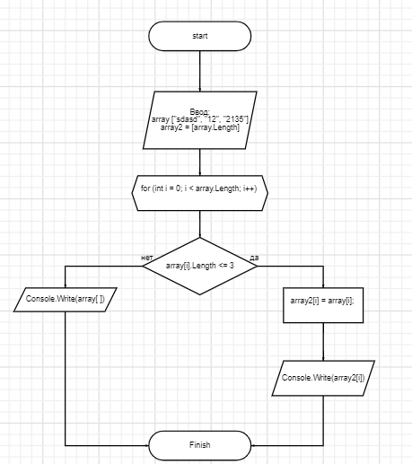

**Описание алгоритма выполнения задания**

1. Создали репозиторий на GitHub
2. Нарисовали Блок-схему решения задачи
   

3. Была создана программа, которая позволяет из заданного массива найти элементы в которых 3 или меньше символов.

- Для начала была написана программа, которая позволяет вводить с клавиатуры количество элементов в массиве, а также был создан пустой массив.
- Затем был создан цикл, в котором мы каждый элемент задаем с клавиатуры
- Создаем цикл, который выводит все заданные с клавиатуры значения в единый массив
- Создаем цикл с условием, который проходит по каждому элементу массива и проверяет его на соответсвие условию.
- Записываем элементы, которые выполняют условия в массив и выводим на экран.
- Код был реализован с помощью методов, которые инциализируют массив, выводят на экран массив и сортируют значения.
